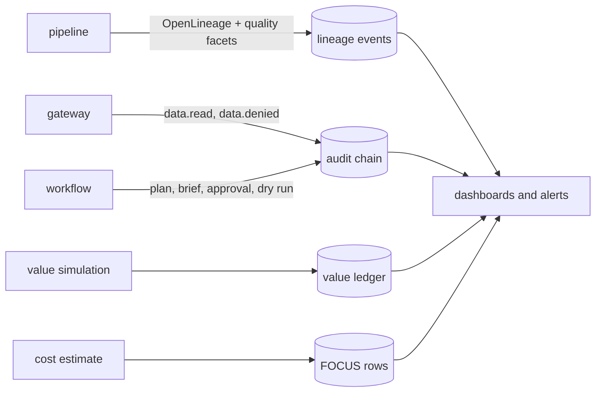

# Observability

What to watch, where each signal comes from today, and where it would go on each cloud.

## Signals

| Signal | Source | Healthy | Alert when |
|---|---|---|---|
| Product quality | `adl quality` | every product passes | any error check fails or an SLO is breached |
| Quarantine rate | `silver.quarantine_*` counts | under the contract's `max_quarantine_pct` | above it |
| Freshness | contract `freshness_days` vs newest day | within SLA | stale |
| Lineage completeness | START/COMPLETE pairs | every START has a COMPLETE | a FAIL or a missing COMPLETE |
| Access denials | `data.denied` audit records | rare, explained | a spike, or denials for an identity that used to work |
| Injection flags | `injection_flag` on rows, `brief.written` with issues | a few flagged notes | fallback briefs rising |
| Approval behaviour | `approval.decided` records | some rejections | approvals with problems (wrong digest, non-person approver) |
| Forecast accuracy | WAPE against outcomes | near the backtest (31.9%) | drift above the 28-day-mean baseline |
| Stockout model ranking | AUC against outcomes | near 0.79 | below the cover rule's F1 |
| Value | value ledger | interval above zero | interval crosses zero |
| Cost | FOCUS rows | about $76 per 28 days at assumed rates | cost per $1,000 of value rising |

## Where the signals go

| Signal | Azure | Google Cloud | AWS |
|---|---|---|---|
| Logs and audit | Log Analytics (diagnostic settings in the Terraform), immutable blob container | Cloud Logging, locked bucket | CloudWatch Logs, S3 Object Lock |
| Agent traces | Agent Framework OpenTelemetry to Application Insights or the Foundry tracing view | Cloud Trace | X-Ray / CloudWatch |
| Lineage | Microsoft Purview | Dataplex lineage | DataZone lineage |
| Data quality | Purview data quality or Fabric | Dataplex data quality | Glue Data Quality |
| Cost | Cost Management exports in FOCUS format | Billing export to BigQuery | Cost and Usage Reports (FOCUS) |

## Today, offline

`adl gate` is the summary signal: 15 checks covering quality, lineage, models, retrieval, access,
injection, approvals, value and adapters. `adl lineage --out out/lineage/events.jsonl` writes the lineage file. The audit
chain is kept in memory per run and verified at the end of `adl agents`, `adl access` and `adl
mcp-demo`.
