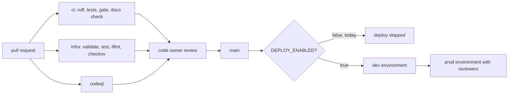

# Operating model

Who owns what, how changes reach production, and how the value is reviewed. The roles are the ones an
enterprise would need to run this beyond a pilot; in this repository they are documented, and the
places where the code enforces them are named.

## Roles

| Role | Owns | Enforced in code by |
|---|---|---|
| Business sponsor (head of merchandising) | The value case and its targets | `config/value-case.yaml`; `adl value` reports hits and misses |
| Decision owners (store, regional and category managers) | Approving or rejecting actions above thresholds | Approval gate requires a `person:` approver and the matching digest |
| Data product owner (per gold product) | The contract, its consumers and acceptable use | `owner` block in every contract; contract validation in CI |
| Data steward | Quality checks, PII flags, classification | Contract checks; PII columns cannot be classified below confidential |
| Agent owner | Agent identity, grants and purposes | `config/agents.yaml`; gateway refuses anything not granted |
| ML owner | Forecast, risk and markdown models and their backtests | Release gate: forecast must beat both baselines, risk model must beat the rule |
| Platform team | Storage, gateway, MCP/A2A, IaC, CI | Workflows, checkov, tflint, Terraform tests |
| Security and privacy | Threat model, attack suite, audit chain | `adl access`, `adl injection`, audit verification in the gate |
| FinOps | Cost per outcome and the FOCUS export | `adl value`, `adl focus` |

## RACI

R = responsible, A = accountable, C = consulted, I = informed.

| Activity | Sponsor | Decision owners | Product owner | Steward | Agent owner | ML owner | Platform | Security | FinOps |
|---|---|---|---|---|---|---|---|---|---|
| Set KPIs and targets | A | C | C | I | I | C | I | I | C |
| Change a data contract | I | I | A | R | C | C | C | C | I |
| Grant an agent a product or purpose | I | I | A | C | R | I | C | C | I |
| Change approval thresholds | A | R | I | I | C | C | I | C | I |
| Retrain or retune a model | I | C | C | I | I | A/R | C | I | I |
| Approve an action above a threshold | I | A/R | I | I | I | I | I | I | I |
| Release (gate must pass) | I | I | C | C | C | C | A/R | C | I |
| Review value and cost each period | A | C | C | I | C | C | I | I | R |
| Respond to an access or injection incident | I | I | C | C | R | I | C | A | I |

## Change path

## Cadence

| Cadence | Review | Input |
|---|---|---|
| Every morning | Store managers approve or reject proposed actions | Approval requests from the workflow |
| Weekly | Category managers review rejections and overrides | Audit chain (`approval.decided` records) |
| Every 28 days | Sponsor, FinOps and ML owner review the ledger | `adl value`, `adl focus` |
| Before any policy change | ML owner reruns the tuning grid on tuning seeds only | `adl tune`, [ADR 0004](adr/0004-policy-tuning.md) |
| Every release | Platform team | `adl gate` |

## Redesigning the work, not only the tool

Store managers stop counting shelves and typing orders; they review a short list of expensive or
unusual actions with the reason for each. Category managers stop setting a flat markdown and instead
own the elasticity tests that feed the markdown model. The data team stops building one-off extracts
and instead owns contracts and products that every agent and dashboard shares.
