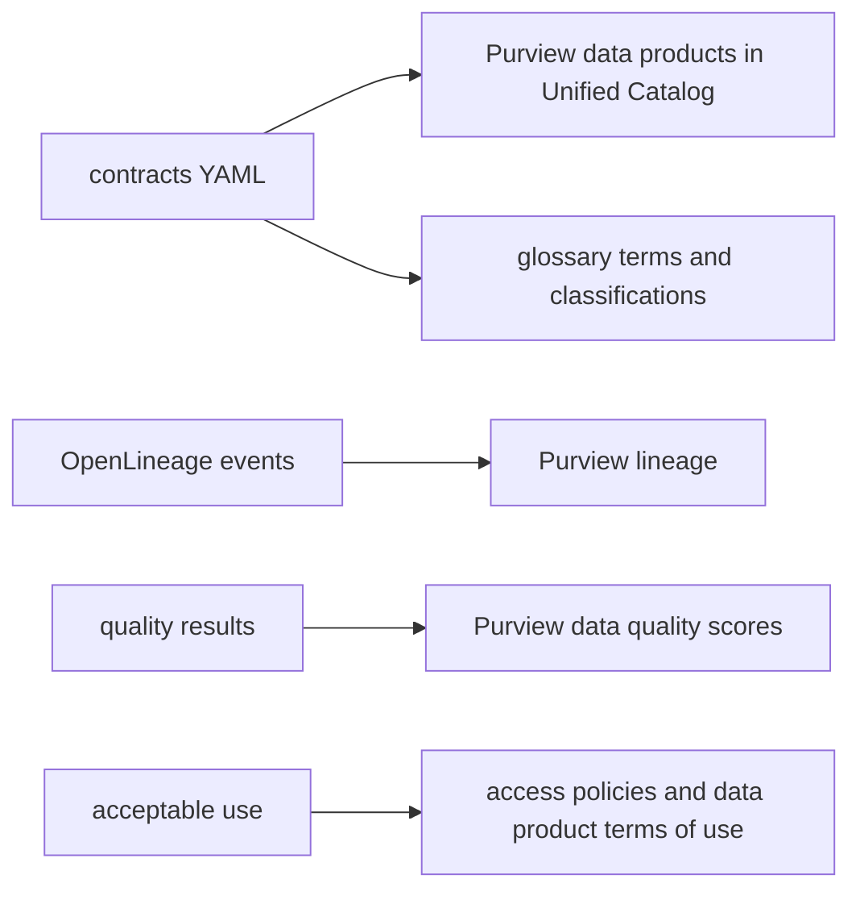

# Microsoft Purview mapping (planned)

Status: **planned**. Nothing here has been registered in a Purview account. This page shows how the
artefacts the repository already produces would land in Microsoft Purview (Unified Catalog, Data Map
and data quality), and what the equivalents are on Google Cloud and AWS.

| Repository artefact | Purview (Azure) | Google Cloud | AWS |
|---|---|---|---|
| Gold contract with `agent_exposed: true` | Data product in Unified Catalog, linked to governance domain "retail" | Dataplex data product / catalog entry | DataZone data product |
| `owner.team`, `owner.steward` | Data product owner and data steward roles | Dataplex data owners and stewards | DataZone project owners |
| `classification`, `pii` flags | Classifications and sensitivity labels | Sensitive Data Protection tags | Macie findings and Lake Formation tags |
| `acceptable_use.allowed_purposes` | Terms of use on the data product, access request policy | Policy tags and IAM conditions | Lake Formation tag-based access |
| Quality checks and SLOs | Data quality rules and scores | Dataplex data quality scans | Glue Data Quality rulesets |
| OpenLineage events | Lineage through the OpenLineage-compatible ingestion | Dataplex data lineage API | DataZone lineage (OpenLineage) |
| Metrics in `metrics.yaml` | Glossary terms with definitions; Fabric semantic model measures | Looker semantic layer | QuickSight topics |

## Steps to make it real

1. Create a governance domain "retail" and register each gold contract as a data product, owner and
   steward from the contract.
2. Apply classifications from the `pii` flags and the contract classification.
3. Write the lineage file with `adl lineage --out out/lineage/events.jsonl` and send it to the OpenLineage endpoint.
4. Turn each contract check into a data quality rule; publish the score next to the product.
5. Express allowed purposes as data product terms of use; keep the gateway as the run-time enforcement.

The gateway remains the enforcement point either way: a catalogue tells people what may be used for
what, and the gateway refuses anything else at the moment of access.
