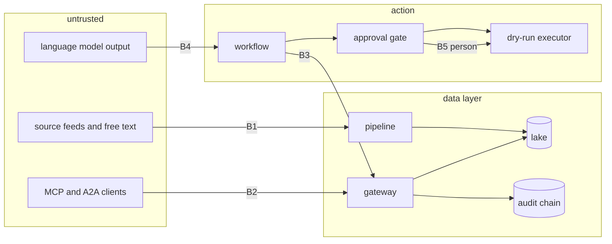

# Threat model

Scope: the data layer, the data gateway, the MCP server, the A2A endpoint, the agent workflow and the
infrastructure definitions. Method: STRIDE per trust boundary, then the OWASP Top 10 for LLM
Applications and MITRE ATLAS for the AI-specific threats. Each control names the test or command that
proves it.

## Trust boundaries

## STRIDE

| Threat | Boundary | Example | Control | Proof |
|---|---|---|---|---|
| Spoofing | B2 | A client claims to be a privileged agent | Identity from a verified token (Entra ID in Azure; demo map here); unknown identities refused | `adl a2a-demo` (no token: -32001), attack "unknown identity" |
| Spoofing | B5 | The model or an agent approves its own action | Approver must be `person:`; approval must name the digest of the exact actions | `tests/test_agents.py` |
| Tampering | B1 | A resent POS batch or bad rows skew the data | Dedup, row-level checks, quarantine, SLOs | `adl run`, `adl quality` |
| Tampering | audit | Someone edits an audit record | SHA-256 hash chain; `verify` fails on edit, delete or reorder | `adl access` (tampered copy detected) |
| Repudiation | all | "The agent did it" | Every read, denial, proposal, approval and dry-run execution is an audit record with the identity | `adl agents` (250 records verified) |
| Information disclosure | B2/B3 | An agent reads PII, cost columns or another region | Products only, purposes, column and row security, PII split, k-anonymity | `adl access` (14/14 stopped, 0 PII rows) |
| Information disclosure | B2 | SQL injection through a filter | Typed filters, plain-identifier values, bound parameters, no SQL from callers | attack "injection in a filter value" |
| Denial of service | B2 | Huge result sets | Per-identity row caps and a global cap of 500 | attack "row cap" |
| Elevation of privilege | B3/B4 | Injected text makes the agent order 900 units | Code plans actions; the brief is validated against the plan; executor only runs planned and approved actions | `adl injection` |
| Elevation of privilege | infra | A workflow gets long-lived cloud keys | OIDC only, no secrets, deploy gated, least-privilege roles | `tests/test_iac.py`, checkov |

## OWASP Top 10 for LLM Applications

| Risk | Relevance here | Control | Proof |
|---|---|---|---|
| LLM01 Prompt injection | Store notes and knowledge documents can carry instructions | Redaction and screening at silver, quoting as untrusted at the gateway, brief validation, code-only actions | `adl injection`: 0 injected actions executed in 4 configurations |
| LLM02 Sensitive information disclosure | Loyalty PII, cost data | PII never in a data product, column denial, redaction | PII scan: 0 rows |
| LLM03 Supply chain | Python and Terraform dependencies, actions | Pinned versions, SHA-pinned actions, Dependabot, CodeQL, SBOM | `.github/workflows/ci.yml` |
| LLM04 Data and model poisoning | Bad source rows train the forecast | Quarantine, contracts, sold-out days excluded from training | `adl quality` |
| LLM05 Improper output handling | The brief could carry actions | Structured output, `validate_brief`, template fallback | `tests/test_agents.py` |
| LLM06 Excessive agency | Agents placing orders | No write tools on MCP; dry-run executor; thresholds and person approval | `adl agents`, `adl mcp-demo` (all tools read-only) |
| LLM07 System prompt leakage | Instructions contain nothing secret | No secrets or rules in prompts; rules live in code and config | review |
| LLM08 Vector and embedding weaknesses | Knowledge retrieval across regions | Results trimmed by the caller's regions before ranking; injection screen on documents | `tests/test_knowledge.py` |
| LLM09 Misinformation | The brief misstates the plan | Brief must match the plan exactly or is replaced | `adl injection` (fallback briefs) |
| LLM10 Unbounded consumption | Model cost | One brief per store per day; token estimate and cost per outcome reported | `adl value` (224 briefs, $0.22) |

## MITRE ATLAS

| Technique | How it would apply | Mitigation here |
|---|---|---|
| AML.T0051 LLM Prompt Injection (indirect) | Instructions in a store note | Quoting, screening, validation, code-only actions |
| AML.T0054 LLM Jailbreak | A client tries to make the brief writer ignore its rules | The writer has no tools and no authority; its output is checked |
| AML.T0057 LLM Data Leakage | The model is asked to reveal customer data | The model never receives PII; the gateway never returns it |
| AML.T0020 Poison Training Data | Fake sales rows to inflate orders | Contracts, quarantine, dedup; backtests in the gate |
| AML.T0024 Exfiltration via ML Inference API | Bulk reads through MCP or A2A | Row caps, purposes, audit of every read |
| AML.T0029 Denial of ML Service | Flooding the endpoint | Row caps here; rate limits at API Management or the load balancer when hosted |
| AML.T0010 ML Supply Chain Compromise | A malicious package | Pinned dependencies, Dependabot, CodeQL, SBOM |

## Residual risks

* The injection screen is a regular-expression stand-in; Azure AI Content Safety Prompt Shields is the
  intended detector and its request is built but never called.
* The A2A demo tokens are fixed strings; a real deployment must validate Entra ID (or Google, AWS)
  tokens and map app ids to identities.
* The audit chain detects tampering but does not prevent deletion of the whole file; immutable storage
  is required in a deployment.
* Nothing is hosted, so network controls (private endpoints, firewalls) are defined in IaC but untested
  against a live environment.
