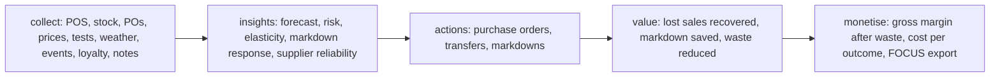

# Value case (Phase 0)

Written before any model, as the article recommends: name the result, the people who own the decision,
the KPIs with a measured baseline and a target, and the path from data to money. The file is
`config/value-case.yaml`; `adl value-case` measures the baselines from gold through the metrics layer
and `adl value` reports the result against the same targets, including the ones that are missed.

## The problem

Wrenfield Grocers (fictional) orders by repeating last week's sales and marks every near-date item down
30%. Shelves run empty on busy days and perishable food is thrown away or discounted more than
needed. The sponsor is the head of merchandising; the decision owners are store managers, regional
operations managers and category managers.

## Baselines and targets

<!-- output: value-case -->
```text
use case: retail-stockout-markdown (retail)
problem: Wrenfield Grocers loses sales when shelves empty and gives margin away when near-date stock is thrown away or marked down too deeply. Orders follow last week's sales and markdowns are a flat 30%.

baseline per 28 days, measured from gold.sales_daily (history under the current rules):
kpi                baseline    target change  target      why
-----------------  ----------  -------------  ----------  ------------------------------------
stockout_rate_pct  5.26        -20%           4.21        fewer empty shelves at close
lost_sales_usd     7,491.04    -25%           5,618.28    demand served instead of lost
markdown_usd       14,276.48   -15%           12,135.01   margin kept on near-date stock
waste_cost_usd     9,665.49    -20%           7,732.39    less stock thrown away
gross_margin_usd   114,646.79  +3%            118,086.19  the bottom line the levers add up to

value tree (MIT CISR five steps):
  collect: POS sales, stock and waste, purchase orders and receipts, promotions, prices and price tests, weather, local events, loyalty segments, store notes
  insights: demand forecast, stockout risk, price elasticity, markdown response, supplier lead-time reliability
  actions: purchase orders, inter-store transfers, markdowns
  value: lost sales recovered, markdown dollars saved, waste reduced
  monetise: gross margin after waste, cost per outcome including AI and platform cost, FOCUS cost export to FinOps
```
<!-- /output -->

## Result against the targets

The forward simulation plays the same 28 days 30 times under the current rules and under the agents'
policy with identical randomness. The KPI table is the honest scorecard: four of five targets met,
stockout rate missed.

<!-- output: value -->
```text
forward simulation: 30 replications x 28 days, common random numbers, paired 95% bootstrap intervals
ledger      lever          metric      current rules  with agents  change   95% interval
----------  -------------  ----------  -------------  -----------  -------  ------------------
VL-RET-001  all levers     net_value   $114,046       $123,724     $9,678   [$9,531, $9,830]
VL-RET-002  all levers     lost_sales  $19,818        $12,366      -$7,452  [-$7,827, -$7,058]
VL-RET-003  all levers     markdown    $14,852        $8,292       -$6,560  [-$6,666, -$6,449]
VL-RET-004  all levers     waste_cost  $10,331        $4,778       -$5,553  [-$5,666, -$5,435]
VL-RET-005  replenishment  net_value   $114,046       $121,386     $7,340   [$7,198, $7,488]
VL-RET-006  replenishment  lost_sales  $19,818        $12,340      -$7,478  [-$7,860, -$7,075]
VL-RET-007  replenishment  markdown    $14,852        $11,348      -$3,504  [-$3,593, -$3,411]
VL-RET-008  replenishment  waste_cost  $10,331        $4,068       -$6,263  [-$6,385, -$6,141]
VL-RET-009  markdown       net_value   $114,046       $115,959     $1,913   [$1,888, $1,938]
VL-RET-010  markdown       lost_sales  $19,818        $19,860      $42      [$16, $67]
VL-RET-011  markdown       markdown    $14,852        $12,273      -$2,579  [-$2,631, -$2,530]
VL-RET-012  markdown       waste_cost  $10,331        $10,959      $628     [$601, $657]

KPI targets (config/value-case.yaml), all levers vs the current rules:
kpi                current rules  with agents  change  target  result
-----------------  -------------  -----------  ------  ------  ------
stockout_rate_pct  5.79           5.72         -1.2%   -20%    MISSED
lost_sales_usd     19,817.95      12,365.68    -37.6%  -25%    met
markdown_usd       14,852.43      8,292.38     -44.2%  -15%    met
waste_cost_usd     10,331.07      4,778.36     -53.7%  -20%    met
gross_margin_usd   114,996.18     124,722.30   +8.5%   +3%     met

estimated AI and platform cost for 28 days (assumed rates in config/pricing.yaml): $76
  Foundry Models: $0.22 (224 briefs)
  Azure Container Apps: $0.76 (25,200 vCPU-seconds)
  Azure AI Search: $70.00 (28 days)
  Storage: $4.67 (28 days)
  prompt 666 tokens and output 461 tokens per brief (measured), 224 briefs
cost per $1,000 of net value: $7.82; per action: $0.0079 (9,588 actions)
value after cost: $9,602 per 28 days (30-replication mean)
```
<!-- /output -->

Note that the baseline in the KPI table (the current rules over the next 28 days) differs from the
history baseline above (the last 140 days scaled to 28): the forward window starts from the stock
actually on hand at the end of history and has its own calendar. Targets are judged against the
forward baseline because that is the like-for-like comparison.

## Why the stockout target was missed

The agents serve more demand on the days that would have sold out (lost sales -37.6%) but the number
of store-product-days that end empty barely changes (5.79% to 5.72%). The perishable safety-stock
setting was chosen to protect net value ([ADR 0004](adr/0004-policy-tuning.md)); a higher service
level cuts stockouts further but loses money in this simulation because it does not model customers
who leave after finding an empty shelf. The right next step is a customer-loss term in the simulator,
not a quieter target.

## Value tree



## How value is attributed

| Ledger rows | Lever | What changes |
|---|---|---|
| VL-RET-001 to 004 | all levers | the agents' full policy |
| VL-RET-005 to 008 | replenishment only | forecast-driven orders and transfers, markdowns stay at the flat 30% |
| VL-RET-009 to 012 | markdown only | minimum-clearing markdowns, orders stay as today |

Each dry-run action in the audit chain carries its ledger id (purchase orders and transfers point to
VL-RET-005, markdowns to VL-RET-009), so an executed action can be traced to the value it is
supposed to create. The markdown lever on its own slightly raises waste (+$628) because fewer
near-date units clear at a shallower discount; it still adds net value because the margin kept is
larger. Together the levers add slightly more than the sum of their separate effects ($9,678 against
$7,340 + $1,913 = $9,253): in this simulation the two levers interact positively, so the attribution
rows are reported separately and never added up.
