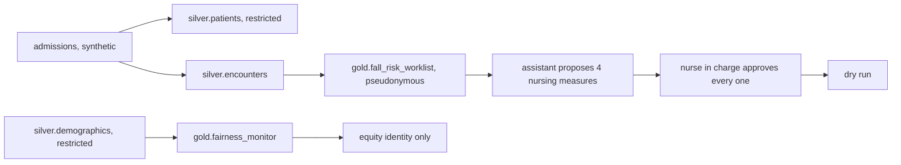

# Healthcare domain: Halsey Vale Health (built)

> **Fully synthetic, PHI-free data.** Every patient, record number, note and outcome is invented by a
> seeded simulator; no real patient data or protected health information is used. The fall-risk model
> is **not a medical device**.

Status: **built** (on synthetic data; nothing is deployed). Halsey Vale Health is fictional: two sites
(Halsey and Vale), twelve wards. The domain runs end to end offline: simulator, bronze/silver/gold
pipeline, contracts and quality, lineage, metrics layer, a fall-risk model backtested against the
Morse rule, knowledge retrieval, an assistant that proposes nursing measures through a
minimum-necessary data gateway for the nurse in charge to approve, a value ledger with intervals and a
fairness check across synthetic patient groups. The full write-up is in
[docs/healthcare](../../docs/healthcare/README.md).

| File | What it does |
|---|---|
| `contracts/` | 15 built contracts: 9 silver tables and 6 gold data products |
| `knowledge/` | The knowledge corpus (24 documents) and its retrieval evaluation set (24 questions) |
| `metrics.yaml` | Governed ward KPIs (falls per 1,000 bed-days, falls with harm, days to first measure, sitter shifts, costs) compiled to SQL |

## The decision

Which preventive nursing measures each in-hospital patient gets each morning: bed alarm, hourly
rounding, mobility aid or sitter request, every one approved by the nurse in charge of the ward.
Capacity stays the same as today; the assistant only changes who gets it. It never proposes anything
clinical (medication, diagnosis, test, treatment or discharge). This is the example the MIT Sloan
article uses to illustrate the five steps from data to money.

| KPI | Direction | Target (set before results) | Result (simulated, 28 days) |
|---|---|---|---|
| Falls per 1,000 bed-days | down | -20% | -7.5%, missed |
| Falls with harm | down | -25% | -3.7%, missed (interval spans zero) |
| Days from admission to first measure | down | -30% | -5.0%, missed |
| Sitter shifts | down | -10% | -100%, met (by booking none, which raises falls) |

Net value of all measures: +$189,002 per 28 days (95% interval $171,462 to $205,593), mostly from booking
no sitters; with sitters kept as today the agent adds +$36,666 (interval $21,258 to $50,542) and cuts
falls from 27.7 to 24.0 per 28 days. See [value-ledger.md](../../docs/healthcare/value-ledger.md).

## Fairness check

`config/healthcare/fairness.yaml`, committed before any result, sets a 0.80 to 1.25 band for the G2/G1
ratio of each measure and of protection before a fall (a screening heuristic, not a legal or regulatory
test) and a 1.5 limit on the gap in falls per 1,000 bed-days. All limits are met in history (6/6) and in
the forward simulation (12/12). See [fairness-check.md](../../docs/healthcare/fairness-check.md).

