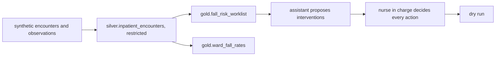

# Healthcare domain: Halsey Vale Health (planned)

Status: **planned, not built**. Halsey Vale Health is fictional and no real patient data will ever be
used; the plan is a synthetic ward simulator.

| File | What it does |
|---|---|
| `contracts/` | Three planned contracts: the restricted encounters table and two agent-exposed products |

## The decision

Which patients the nurse in charge should check first on each shift, to prevent inpatient falls. This
is the example the MIT Sloan article uses to illustrate the five steps from data to money, so this
domain will show the same path in a second industry.

| KPI | Direction |
|---|---|
| Falls per 1,000 bed-days | down |
| Falls with harm | down |
| Time to intervention | down |

Levers: bed alarm, hourly rounding, mobility support.

## Plan

Every intervention is approved by a nurse (no automatic actions). Insurance eligibility and employee
performance management are prohibited purposes in the contracts. Planned third.
