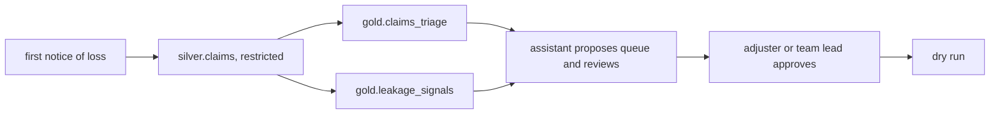

# Insurance domain: Ferrowind Insurance (planned)

Status: **planned, not built**. Ferrowind Insurance is fictional. Only the contracts below exist; they
validate in CI with `status: planned`.

| File | What it does |
|---|---|
| `contracts/` | Three planned contracts: the restricted claims table and two agent-exposed products |

## The decision

Which queue each new claim goes to (fast track, standard, complex), and which closed claims to review
for leakage (overpayment, missed subrogation).

| KPI | Direction |
|---|---|
| Cycle time | down |
| Leakage dollars | down |
| Reopen rate | down |
| Adjuster workload balance | even |

Levers: queue assignment, leakage review, subrogation referral.

## Plan

Adjuster notes are free text, so they get the same redaction, screening and untrusted quoting as
retail store notes. Denying a claim without human review is a prohibited purpose in the contracts.
Planned after mortgage.
