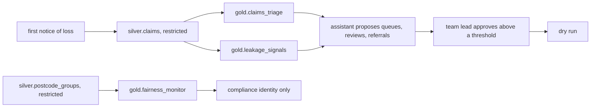

# Insurance domain: Ferrowind Insurance (built)

Status: **built** (on synthetic data; nothing is deployed). Ferrowind Insurance is fictional. The
domain runs end to end offline: simulator, bronze/silver/gold pipeline, contracts and quality,
lineage, metrics layer, three claim models with backtests, knowledge retrieval, an assistant that
proposes actions through the data gateway with human approval, a value ledger with intervals and an
unfair-discrimination screen across synthetic postcode proxy groups. The full write-up is in
[docs/insurance](../../docs/insurance/README.md).

| File | What it does |
|---|---|
| `contracts/` | 18 built contracts: 11 silver tables and 7 gold data products |
| `knowledge/` | The knowledge corpus (24 documents) and its retrieval evaluation set (24 questions) |
| `metrics.yaml` | Governed claims KPIs (cycle days, reopen rate, escalations, reviews, referrals, audit-scaled leakage) compiled to SQL |

## The decision

Which queue each new claim goes to (fast track, standard or the complex unit), which payments the
review team checks before they are released, and which claims go to the subrogation unit for
recovery. Capacity stays the same as today; the assistant only changes how it is used. No action
denies, reduces or delays a claim.

| KPI | Direction | Target (set before results) | Result (simulated, 28 days) |
|---|---|---|---|
| Cycle days | down | -10% | -1.1%, missed |
| Leakage dollars | down | -25% | -30.4%, met |
| Reopen rate | down | -15% | +3.3%, missed (worse) |
| Backlog spread across queues | down | -20% | -13.0%, missed |

Levers: queue assignment, leakage review, subrogation referral. Net value of all levers: +$274,527 per
28 days (95% interval $249,068 to $299,963), almost all from subrogation referral.

## Fairness screen

`config/insurance/fairness.yaml`, committed before any result, sets a 0.80 to 1.25 band for the G2/G1
selection-rate ratio of each decision (the four-fifths heuristic, used here as a screening threshold,
not a legal test) and a 2-day limit on the gap in days to payment. Every ratio is inside the band in
history and in the forward simulation; the agent fast-tracks G2 measurably less than today's rules
(0.931 against 0.984). See [fairness-check.md](../../docs/insurance/fairness-check.md).

