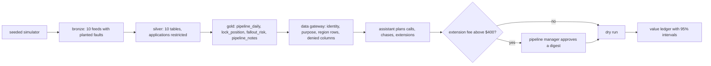

# Mortgage domain: Quillmere Home Loans (built)

Status: **built** (on synthetic data; nothing is deployed). Quillmere Home Loans is fictional. The
domain runs end to end offline: simulator, bronze/silver/gold pipeline, contracts and quality,
lineage, metrics layer, fallout-risk model with a backtest, knowledge retrieval, an assistant that
proposes actions through the data gateway with human approval, and a value ledger with intervals.
The full write-up is in [docs/mortgage](../../docs/mortgage/README.md).

| File | What it does |
|---|---|
| `contracts/` | 15 built contracts: 10 silver tables and 5 gold data products |
| `knowledge/` | The knowledge corpus (24 documents) and its retrieval evaluation set (24 questions) |
| `metrics.yaml` | Governed pipeline KPIs (pull-through, fallout, extension cost, cycle time) compiled to SQL |

## The decision

Which locked applications get the loan officers' 60 calls and the processors' 60 document chases
today, and which expiring locks are worth extending, so more locked loans close. Fallout after a lock
costs the lender the hedge and the expected gain on sale.

| KPI | Direction | Target (set before results) |
|---|---|---|
| Pull-through rate | up | +3% |
| Fallout rate | down | -12% |
| Lock extension cost | down | -20% |
| Lock-to-close cycle time | down | -5% |

Levers: borrower outreach, document chase, lock extension. Capacity stays the same as today; the
assistant only changes who gets it.

## Results in one table (from `adl mortgage ...`, synthetic data)

| What | Result |
|---|---|
| Fallout model vs "within 10 days, closest first" | AUC 0.730 vs 0.462; 51.6% vs 6.9% of value at risk covered by 60 calls a day |
| Net value, all levers, 28 days | +$193,003, 95% interval [$171,585, $214,486] over 30 paired replications |
| KPI targets | 1 of 4 met: fallout rate -14.9% (target -12%); pull-through +2.4% (target +3%), extension cost -6.6% (target -20%) and cycle time -0.6% (target -5%) missed |
| Access attacks | 14 of 14 stopped; 0 borrower PII rows in agent-exposed products |
| Injection | 0 injected actions executed in all 4 defence configurations |
| Release gate | 11 of 11 mortgage checks pass |

The rendered outputs and their explanation are in the component docs; the numbers above are checked
against those outputs by hand, the component docs are checked by CI.

## Business model (MIT CISR, paraphrased)

Mortgage starts at **Existing+**: AI improves the lender's current pipeline process. The step to
**Customer Proxy** would be a borrower-side assistant that keeps a file moving (documents, lock
decisions) within limits the borrower sets; that needs a borrower-consented purpose in the contracts
and is planned, design only. See [docs/mortgage/README.md](../../docs/mortgage/README.md#business-model-mapping-mit-cisr).
