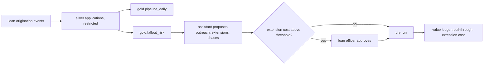

# Mortgage domain: Quillmere Home Loans (planned)

Status: **planned, not built**. Quillmere Home Loans is fictional. Only the contracts below exist; they
validate in CI with `status: planned`. There is no pipeline, model or agent for this domain yet.

| File | What it does |
|---|---|
| `contracts/` | Three planned contracts: the restricted applications table and two agent-exposed products |

## The decision

Which locked applications need a call today so they close before the rate lock expires. Fallout after
a lock costs the lender the hedge and the borrower the rate.

| KPI | Direction |
|---|---|
| Pull-through rate | up |
| Fallout rate | down |
| Lock extension cost | down |
| Cycle time | down |

Levers: borrower outreach, lock extension, document chase.

## Plan (next domain to build)

1. Synthetic loan origination feed with stage dates, locks, documents and known fallout drivers.
2. Silver applications (applicant name restricted, pseudonymous key elsewhere), gold pipeline and
   fallout risk with a backtest against "call everyone within 10 days of expiry".
3. An assistant identity granted `pipeline_management` only; credit decisioning is prohibited in the
   contracts, so the gateway refuses it.
4. A value ledger for pull-through and extension cost, with the same interval and cost-per-outcome
   reporting as retail.

Reused from the core without change: contracts, quality, lineage, metrics layer, gateway, audit, MCP,
A2A, storage adapters and IaC.
